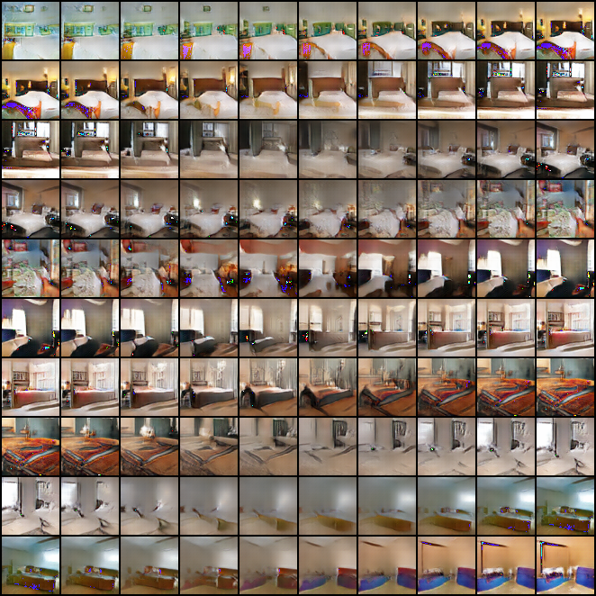

# DCGAN - Deep Convolutional Generative Adversarial Networks
## [Dao Duy Hung](https://github.com/daoduyhungkaistgit) - [KAIST](https://www.kaist.ac.kr/en/)

This project is conducted for the sake of reimplementation of the main paper. The project is implemented mainly with **Pytorch**.  
Paper: [Unsupervised Representation Learning with Deep Convolutional Generative Adversarial Networks](http://arxiv.org/abs/1511.06434)

## Data
### LSUN
The paper used the [LSUN](https://www.yf.io/p/lsun) which is a Large-scale Image Dataset with approax 3 milion bedroom scence images. 

**Generation over interpolated point in noise dimension**

Generation over interpolated points between 11 random noise code to see transition between points. 

**Guided backpropagation to visualize learned feature of Discriminator**

Last row illustrates reconstructed images from learned features of trained Discriminator. Middle row is images which conversely are attained from a non-trained Discriminator.
## Traning
- Modify config file in /src/cfg to setup for training process or
- Set parameters directly with `dcgan_lsun.py`

Run
```
python3 src/models/dcgan_lsun.py
```
